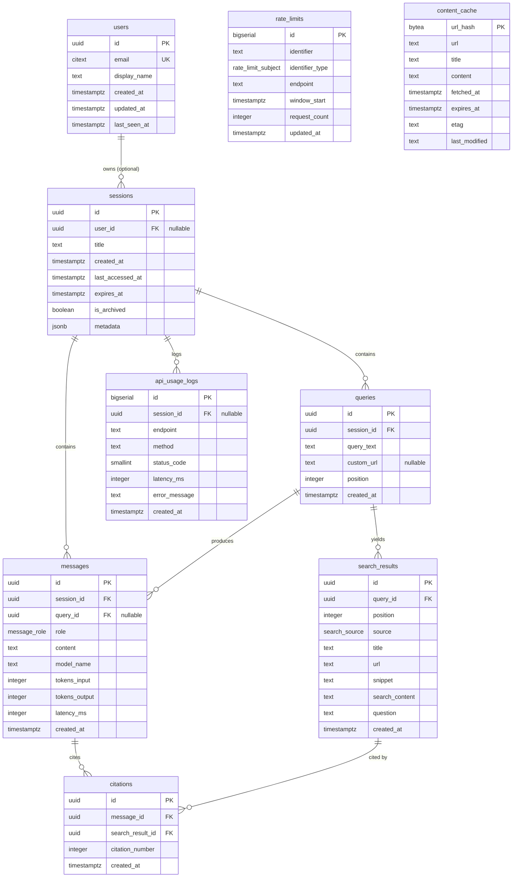

# Entity-Relationship Diagram

## Relationship cardinality

| From | To | Cardinality | On delete |
| --- | --- | --- | --- |
| `users` | `sessions` | 1 — 0..N | SET NULL on `sessions.user_id` |
| `sessions` | `queries` | 1 — 0..N | CASCADE |
| `sessions` | `messages` | 1 — 0..N | CASCADE |
| `queries` | `messages` | 1 — 0..N | CASCADE |
| `queries` | `search_results` | 1 — 0..N | CASCADE |
| `messages` | `citations` | 1 — 0..N | CASCADE |
| `search_results` | `citations` | 1 — 0..N | CASCADE |
| `sessions` | `api_usage_logs` | 1 — 0..N | SET NULL |

`rate_limits` and `content_cache` are standalone — no FKs, intentionally.
