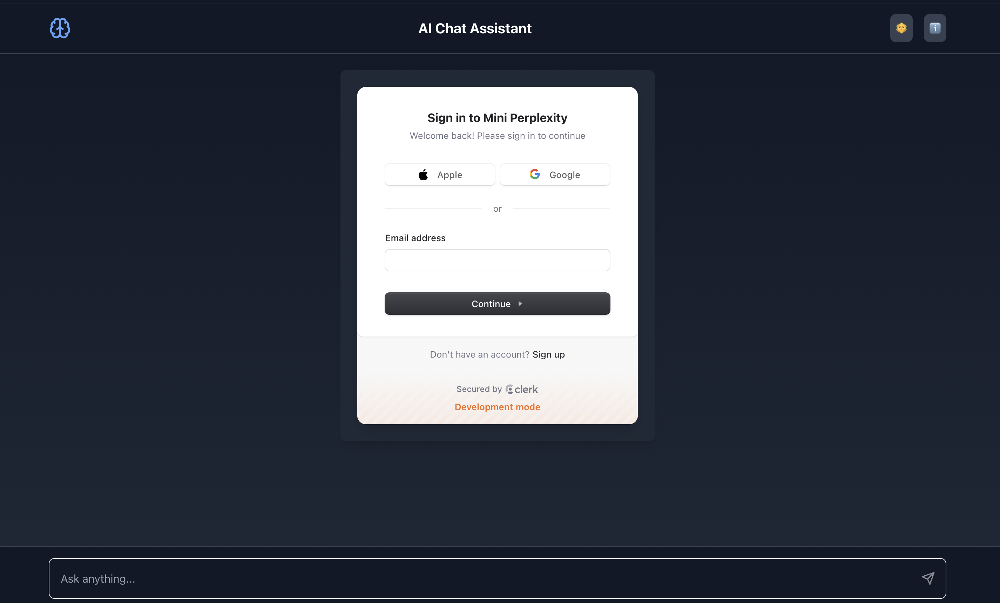
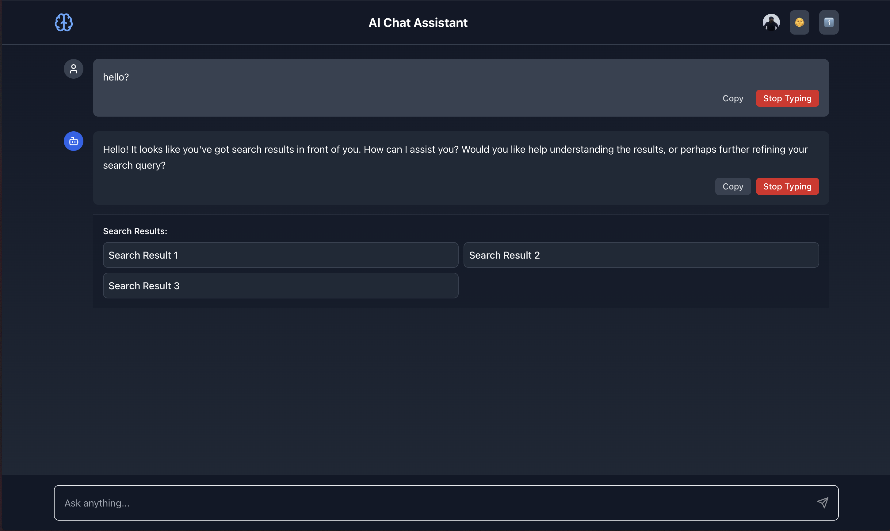

# Mini Perplexity

Visit [Mini Perplexity](https://mini-perplexity.netlify.app/) to checkout the project for yourself!


Mini Perplexity is an AI-powered chat assistant built with React, TypeScript, and Tailwind CSS. It leverages Cloudflare's AI models to provide intelligent responses to user queries, along with a dynamic and visually appealing user interface.

## Features

- **AI-Powered Responses**: Utilizes Cloudflare's AI models to generate answers based on user queries.
- **Dynamic Background Animations**: Includes animated text and particles to enhance the user experience.
- **Dark Mode Support**: Offers a dark mode for better usability in low-light environments.
- **Responsive Design**: Fully responsive layout that works on various screen sizes.
- **User Authentication**: Integrated with Clerk for user authentication and management.

## Technologies Used

- **Frontend**: 
  - React
  - TypeScript
  - Tailwind CSS
  - Lucide React (for icons)
- **Backend**: 
  - FastAPI
  - Pydantic
  - Cloudflare API
- **Deployment**: 
  - Vite for development and build
  - Netlify for hosting

## Deployment Status

[](https://app.netlify.com/sites/mini-perplexity/deploys)

## Metrics

- **Build Time**: Approximately 27 seconds
- **Page Load Time**: Under 1 second on average
- **First Contentful Paint (FCP)**: ~300ms
- **Time to Interactive (TTI)**: ~500ms

## Maintaining LLM Context

### Backend

In the backend, we maintain the context for the Large Language Model (LLM) by utilizing session IDs that are generated for each user interaction. When a user sends a query, the backend associates that query with the user's session ID. This allows the backend to keep track of the conversation history and context, which is essential for generating coherent and contextually relevant responses.

1. **Session Management**: Each user session is uniquely identified using a UUID, which is generated when the user starts interacting with the assistant. This session ID is passed along with each request to ensure that the context is preserved.

2. **Conversation History**: The backend stores the conversation history in memory or a temporary database, allowing it to reference previous messages when generating responses. This helps the LLM understand the context of the conversation and provide more accurate answers.

3. **API Integration**: When a query is received, the backend fetches the relevant context and sends it to the Cloudflare AI model along with the user's query. The model then generates a response based on the provided context.

### Frontend

On the frontend, we maintain the context by managing the state of the conversation within the React application. 

1. **State Management**: The application uses React's state management to keep track of messages exchanged between the user and the assistant. Each message is stored in an array, which allows the application to render the conversation dynamically.

2. **User Interface**: The frontend displays the conversation history, allowing users to see previous messages. This visual representation helps users understand the context of the current interaction.

3. **Handling Responses**: When the user submits a query, the frontend sends the current message along with the session ID to the backend. Once the response is received, it updates the state to include the new message, ensuring that the conversation flow is maintained.

## Installation

To get started with the project, follow these steps:

1. Clone the repository:

   ```bash
   git clone https://github.com/paritoshtripathi935/mini-perplexity.git
   cd mini-perplexity
   ```

2. Install the dependencies:

   For the frontend:

   ```bash
   cd frontend
   npm install
   ```

   For the backend:

   ```bash
   cd backend
   pip install -r requirements.txt
   ```

3. Set up environment variables:

   Create a `.env` file in the backend directory and add your Cloudflare API credentials:

   ```
   CLOUDFLARE_API_KEY=your_api_key
   CLOUDFLARE_ACCOUNT_ID=your_account_id
   ```

4. Run the backend server:

   ```bash
   cd backend
   uvicorn app.main:app --host 0.0.0.0 --port 8000
   ```

5. Run the frontend development server:

   ```bash
   cd frontend
   npm run dev
   ```

6. Open your browser and navigate to `http://localhost:3000` to see the application in action.

## Usage

- Enter your query in the search bar and hit enter or click the send button.
- The assistant will respond with an AI-generated answer.
- You can toggle dark mode using the button in the header.

### Screenshots

#### 1. Home Screen


#### 2. Entering a Query


#### 3. AI Response


## Contributing

Contributions are welcome! If you have suggestions for improvements or new features, feel free to open an issue or submit a pull request.

## License

This project is licensed under the MIT License. See the [LICENSE](LICENSE) file for details.

## Acknowledgments

- Thanks to Cloudflare for providing the AI models.
- Special thanks to the open-source community for the libraries and tools used in this project.
