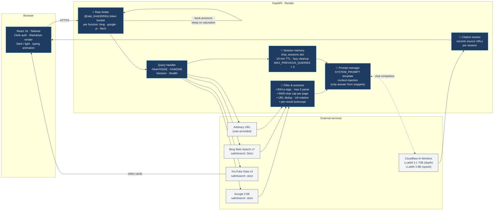
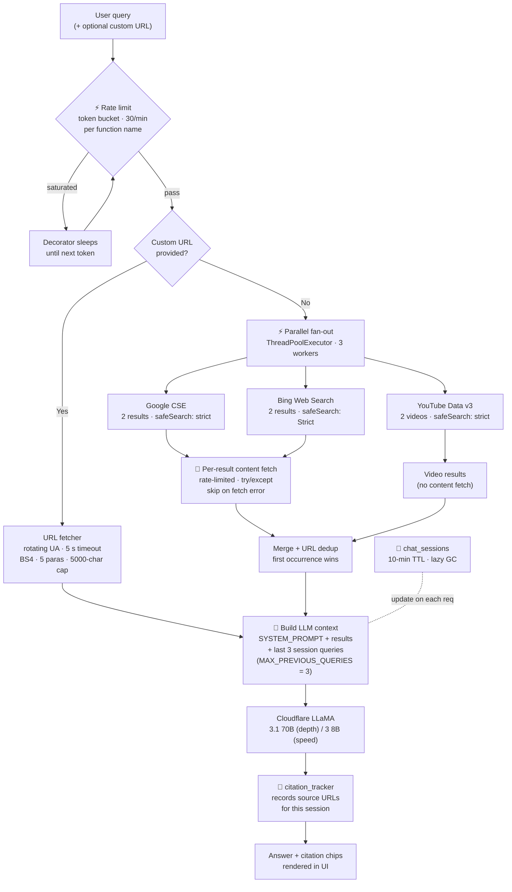

# PaidPilot

**An AI co-pilot for in-house performance marketers.**
Benchmarks, briefs, and channel plans grounded in citations from sources you actually trust — Meta &amp; Google docs, eMarketer, Adweek — with your brand context baked into every answer. Free while in beta.

> Originally built as Mini Perplexity (a generic Perplexity-style search engine) and pivoted to a marketing-focused product. The core RAG plumbing — dual-provider web search, live URL reading, citation tracking — is reused; the V1 layer adds per-user brand profiles, source-authority re-ranking, a curated "Plays" library (creative briefs, channel plans, A/B specs), and built-in calculators (CAC payback, ROAS-to-margin, sample size, blended efficiency). See [docs/product/V1_PLAN.md](docs/product/V1_PLAN.md) for the rationale.

### 🔗 [**Try the live demo →**](https://mini-perplexity.netlify.app/)

[](https://mini-perplexity.netlify.app/)
[](https://app.netlify.com/sites/mini-perplexity/deploys)
[](https://github.com/paritoshtripathi935/MiniPerplexity/stargazers)
[](LICENSE)
[](https://www.python.org/)
[](https://fastapi.tiangolo.com/)
[](https://react.dev/)
[](https://developers.cloudflare.com/workers-ai/)

---

## What it does

Mini Perplexity turns a plain-English question ("*what changed in Python 3.13?*") into a grounded, cited answer with:

- **Dual-provider web search** — Google CSE and Bing Web Search are queried in parallel; results are deduplicated and extracted into clean text before the model sees them.
- **Live URL reading** — paste a URL and the model answers about that specific page, not from its training data.
- **Conversational context** — the last three queries per session are threaded back into the prompt for follow-up questions.
- **Per-session rate limiting** — sliding-window limiter (30 req/min) on every content fetch, plus user-agent rotation to play nicely with upstream providers.
- **Multi-model support** — LLaMA 3.1 70B Instruct for depth, LLaMA 3 8B Instruct for latency-sensitive queries.
- **Citation tracking** — every answer keeps the list of source URLs it was grounded in, surfaced in the UI.
- **Clerk auth** — Google/GitHub sign-in out of the box; guest access gated behind an env flag.
- **Dark / light themes** with animated typing and responsive layout.

---

## Architecture


```mermaid
flowchart LR
    subgraph Client["Browser"]
        UI["React 18 · Tailwind<br/>Clerk auth · Markdown render<br/>Dark / light · typing animation"]
    end

    subgraph Backend["FastAPI · Render"]
        direction TB
        RL["⚡ Rate limiter<br/>@rate_limit(30/60s) token bucket<br/>per function: bing · google · yt · fetch"]
        H["Query handler<br/>/search/{sid} · /chat/{sid}<br/>/session · /health"]
        SM["💬 Session memory<br/>chat_sessions dict<br/>10-min TTL · lazy cleanup<br/>MAX_PREVIOUS_QUERIES = 3"]
        PM["📝 Prompt manager<br/>SYSTEM_PROMPT template<br/>context-injection<br/>(only answer from snippets)"]
        FS["🧹 Filter & extractor<br/>• BS4 p-tags · max 5 paras<br/>• 5000-char cap per page<br/>• URL dedup · UA rotation<br/>• per-result try/except"]
        CT["🔖 Citation tracker<br/>records source URLs<br/>per session"]
    end

    subgraph External["External services"]
        LLM["Cloudflare AI Workers<br/>LLaMA 3.1 70B (depth)<br/>LLaMA 3 8B (speed)"]
        G["Google CSE<br/>safeSearch: strict"]
        B["Bing Web Search v7<br/>safeSearch: Strict"]
        YT["YouTube Data v3<br/>safeSearch: strict"]
        URL["Arbitrary URL<br/>(user-provided)"]
    end

    UI -- "HTTPS" --> RL
    RL -- "back-pressure<br/>sleep on saturation" --> RL
    RL --> H
    H --> SM
    H --> G
    H --> B
    H --> YT
    H --> URL
    G --> FS
    B --> FS
    URL --> FS
    YT -- "video cards" --> UI
    FS --> PM
    SM --> PM
    PM <-. "chat completion" .-> LLM
    LLM --> CT
    CT --> UI

    classDef ours fill:#1e3a5f,stroke:#61dafb,color:#fff
    classDef ext fill:#f5f5f5,stroke:#1e3a5f,color:#1e3a5f
    class UI,RL,H,SM,PM,FS,CT ours
    class LLM,G,B,YT,URL ext
```

### Request pipeline


```mermaid
flowchart TD
    Q["User query<br/>(+ optional custom URL)"] --> RL{"⚡ Rate limit<br/>token bucket · 30/min<br/>per function name"}
    RL -- "saturated" --> RL1["Decorator sleeps<br/>until next token"]
    RL1 --> RL
    RL -- "pass" --> S{"Custom URL<br/>provided?"}
    S -- "Yes" --> UF["URL fetcher<br/>rotating UA · 5 s timeout<br/>BS4 · 5 paras · 5000-char cap"]
    S -- "No" --> PAR["⚡ Parallel fan-out<br/>ThreadPoolExecutor · 3 workers"]
    PAR --> GS["Google CSE<br/>2 results · safeSearch: strict"]
    PAR --> BS["Bing Web Search<br/>2 results · safeSearch: Strict"]
    PAR --> YS["YouTube Data v3<br/>2 videos · safeSearch: strict"]
    GS --> FE["🧹 Per-result content fetch<br/>rate-limited · try/except<br/>skip on fetch error"]
    BS --> FE
    YS --> VR["Video results<br/>(no content fetch)"]
    FE --> MRG["Merge + URL dedup<br/>first occurrence wins"]
    VR --> MRG
    UF --> CTX
    MRG --> CTX["📝 Build LLM context<br/>SYSTEM_PROMPT + results<br/>+ last 3 session queries<br/>(MAX_PREVIOUS_QUERIES = 3)"]
    CTX --> LLM["Cloudflare LLaMA<br/>3.1 70B (depth) / 3 8B (speed)"]
    LLM --> CT["🔖 citation_tracker<br/>records source URLs<br/>for this session"]
    CT --> ANS["Answer + citation chips<br/>rendered in UI"]
    SESS["💬 chat_sessions<br/>10-min TTL · lazy GC"] -. "update on each req" .- CTX
```

---

## Engineering highlights

| Concern | How it's handled |
| --- | --- |
| **Two search providers, one answer** | Google and Bing queried in parallel via `ThreadPoolExecutor`; results merged and deduplicated by URL before ranking. |
| **Dead links / flaky targets** | Per-fetch `try/except` with 5 s timeout — one dead page never poisons the whole result set. |
| **Scraping etiquette** | `@rate_limit(calls=30, period=60)` decorator on every content fetch plus rotating User-Agent strings from a small pool. |
| **Context length control** | Extracted page content capped at 5000 chars / 5 paragraphs; last 3 session queries threaded into the prompt (`MAX_PREVIOUS_QUERIES = 3`). |
| **Server-side state** | In-memory `chat_sessions` dict keyed by `session_id`, with 10-minute TTL and lazy cleanup on each request. No external DB. |
| **Secrets handling** | All API keys server-side; frontend only sees `VITE_API_HOST` and the Clerk publishable key. |
| **Cold starts on Render** | Free-tier backend spins down after inactivity — first request after idle may take ~30 s. Health-check ping via Better Stack keeps it warm during demo windows. |
| **Hallucination surface area** | The system prompt is instructed to answer *only* from the provided search snippets; citation tracker captures the URLs the answer was grounded in. |

---

## Tech stack

| Layer           | Choice                                                    |
| --------------- | --------------------------------------------------------- |
| Frontend        | React 18, TypeScript, Tailwind CSS, Lucide icons           |
| Auth            | Clerk                                                     |
| Markdown        | `react-markdown`                                          |
| Backend         | FastAPI, Pydantic, Uvicorn, Gunicorn                      |
| HTML extraction | BeautifulSoup 4                                           |
| Parallelism     | `concurrent.futures.ThreadPoolExecutor`                   |
| LLM             | Cloudflare AI Workers — `@cf/meta/llama-3.1-70b-instruct` & 8B |
| Search          | Google Custom Search · Bing Web Search v7                 |
| Rate limiting   | Custom sliding-window decorator (30 calls / 60 s)         |
| Deploy          | Netlify (frontend) · Render (backend)                     |

---

## Project layout

```
MiniPerplexity/
├── backend/
│   ├── Procfile
│   ├── render.yaml
│   ├── gunicorn.conf.py
│   ├── requirements.txt
│   ├── pytest.ini
│   ├── tests/
│   └── app/
│       ├── main.py                       # FastAPI entry, CORS, router mount
│       ├── api/v1/query_handler.py       # /search, /chat, /session
│       ├── core/                         # settings & config
│       ├── constants/constants.py        # env-driven constants
│       ├── services/
│       │   ├── search_service.py         # Google + Bing parallel search, URL fetch
│       │   ├── language_model.py         # Cloudflare chat completion wrapper
│       │   └── youtube_service.py
│       ├── models/                       # Pydantic request/response schemas
│       └── utils/
│           ├── rate_limter.py            # @rate_limit decorator
│           └── citation_tracker.py       # tracks source URLs per session
│
└── frontend/
    ├── package.json
    ├── vite.config.ts
    ├── tailwind.config.js
    ├── netlify.toml
    └── src/
        ├── App.tsx
        ├── main.tsx
        ├── index.css
        ├── background-animation.css
        ├── components/                    # UI components
        ├── services/                      # API client
        ├── types/                         # TS types
        └── utils/
```

---

## Running locally

### Prerequisites
- Python 3.8+
- Node 16+ and npm
- A Cloudflare AI Workers account (API key + account ID)
- A Google API key with Custom Search enabled + a CSE `cx`
- A Bing Search v7 API key
- A Clerk project (publishable + secret keys)

### 1. Backend

```bash
cd backend
python -m venv .venv && source .venv/bin/activate
pip install -r requirements.txt
cp .env.example .env    # fill in your tokens (see below)
uvicorn app.main:app --reload --port 8000
```

### 2. Frontend

```bash
cd frontend
npm install
cp .env.example .env    # set VITE_API_HOST and VITE_CLERK_PUBLISHABLE_KEY
npm run dev
```

Open [http://localhost:5173](http://localhost:5173) and start asking.

---

## Environment variables

### Backend (`backend/.env`)

| Variable                  | Required | Purpose                                             |
| ------------------------- | :------: | --------------------------------------------------- |
| `CLOUDFLARE_API_KEY`      |    ✅    | Cloudflare AI Workers auth token                    |
| `CLOUDFLARE_ACCOUNT_ID`   |    ✅    | Cloudflare account ID                               |
| `GOOGLE_API_KEY`          |    ✅    | Google Custom Search API key                        |
| `GOOGLE_SEARCH_CX`        |    ✅    | Custom Search Engine ID                             |
| `BING_API_KEY`            |    ✅    | Bing Web Search v7 key                              |
| `CLERK_SECRET_KEY`        |          | Server-side Clerk verification                      |
| `ALLOWED_ORIGINS`         |          | Comma-separated CORS origins                        |

### Frontend (`frontend/.env`)

| Variable                      | Required | Purpose                      |
| ----------------------------- | :------: | ---------------------------- |
| `VITE_API_HOST`               |    ✅    | Backend base URL             |
| `VITE_CLERK_PUBLISHABLE_KEY`  |    ✅    | Clerk client publishable key |

---

## API

```
POST   /api/v1/search/{session_id}    → dual-provider search results
POST   /api/v1/chat/{session_id}      → grounded chat completion
DELETE /api/v1/session/{session_id}   → clear server-side session state
GET    /api/v1/health                 → liveness probe
```

Sessions expire after 10 minutes of inactivity (`SESSION_TTL = timedelta(minutes=10)`); the last 3 queries per session are retained as conversational context (`MAX_PREVIOUS_QUERIES = 3`).

---

## Roadmap

- **Streaming responses** (SSE) so users see the first token in <1 s instead of waiting for the whole answer.
- **Reciprocal-rank fusion** for Google + Bing merge (cleaner than dedupe-by-URL).
- **Answer grounding check** — verify each claim in the answer actually appears in the retrieved snippets; report a hallucination rate metric in the README.
- **Redis cache** — semantic + exact-match cache over recent queries to cut repeat-query LLM spend.
- **Multi-model routing** — Groq for speed-sensitive queries, LLaMA 70B for deep ones.
- **Eval harness** — golden-set of 30–50 questions with expected citations, run in CI.
- **Load test** — publish k6/Locust results (p50 / p95 / p99, sustained RPS) in the README.

---

## Deploy

- **Frontend → Netlify.** `netlify.toml` points to `frontend/` with `npm run build`.
- **Backend → Render.** `render.yaml` declares a web service from `backend/` running `gunicorn` with a Uvicorn worker.

Update `ALLOWED_ORIGINS` on Render to your Netlify domain before promoting.

---

## Credits

Built by **[Paritosh Tripathi](https://paritoshdev.netlify.app/)**.
Domain-specific fork/companion: [**MiniHarvey**](https://github.com/paritoshtripathi935/MiniHarvery) — the same shape, repurposed as an Indian-law research workbench.

## License

MIT — see [`LICENSE`](LICENSE).
