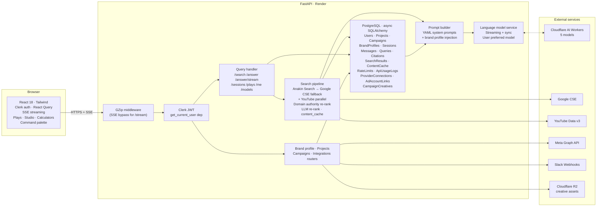
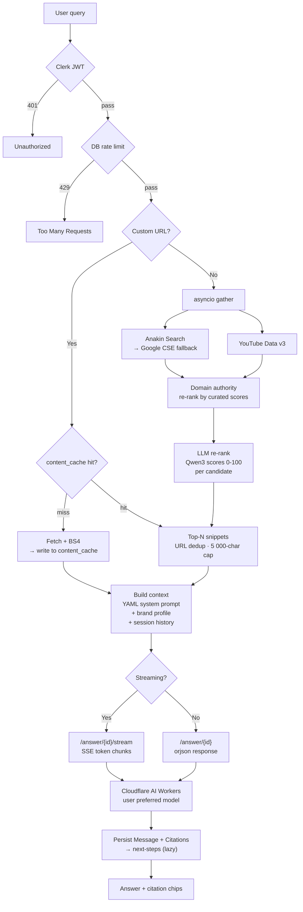

# PaidPilot

**An AI co-pilot for in-house performance marketers.**
Benchmarks, briefs, and channel plans grounded in citations from sources you actually trust — Meta & Google docs, eMarketer, Adweek — with your brand context baked into every answer.

### [**Try it live →**](https://paidpilot.netlify.app/)

[](https://paidpilot.netlify.app/)
[](https://app.netlify.com/sites/mini-perplexity/deploys)
[](https://github.com/paritoshtripathi935/MiniPerplexity/stargazers)
[](LICENSE)
[](https://www.python.org/)
[](https://fastapi.tiangolo.com/)
[](https://react.dev/)
[](https://developers.cloudflare.com/workers-ai/)

---

## What it does

PaidPilot is a research-and-brief tool built for senior performance marketers. Ask a question; get a grounded, cited answer scoped to your brand.

- **Grounded answers with inline citations** — searches via Anakin Search (with Google CSE as automatic fallback), plus YouTube, re-ranks results by domain authority (hand-curated scores for 100+ marketing sources: Meta docs, Google Ads help, eMarketer, Wordstream, etc.), then runs an LLM re-ranker to pick the most relevant snippets before the answer model ever sees them.
- **SSE streaming** — answers stream token-by-token; first word in under a second.
- **Brand profiles** — ICP, primary channels, target CAC/ROAS, and voice guidelines are injected into the system prompt for every chat scoped to a project.
- **Projects & Campaigns** — work is organized into Projects (one brand profile each) and time-bounded Campaigns that anchor chat sessions.
- **Plays** — a curated library of 10 structured-prompt templates for common marketing workflows (see below). Each play pre-loads the model with domain instructions and a defined output schema.
- **Studio** — AI creative generation surface. Enter a brief, generate a batch of tile previews, save or discard each one individually, and browse the full chronological generation history per campaign.
- **Creatives library** — per-campaign asset library for PDFs and images. Upload via presigned URL directly to Cloudflare R2 (backend signs, never sees bytes), then preview, download, or delete from a thumbnail grid.
- **Calculators** — CAC payback, ROAS-to-margin, sample size, and blended efficiency, with scenario saving and side-by-side comparison.
- **Integrations** — Meta OAuth (ad account linking), Slack incoming webhook (share answers directly to a Slack channel), Google Ads (coming soon).
- **Multi-model** — five Cloudflare AI models selectable per user; preference stored in the DB and respected on every request.
- **Next-steps** — after each answer the model suggests three follow-up questions, lazily generated and cached per message.
- **Session export** — export any investigation as JSON.
- **Clerk auth** — Google / GitHub sign-in with server-side JWT verification on every protected route.

---

## Models

All models run on Cloudflare AI Workers. Users pick their preferred model in the chat header; the choice is stored per-user in the DB.

| Model | Cloudflare slug | Notes |
| --- | --- | --- |
| **GPT-OSS 120B** *(default)* | `@cf/openai/gpt-oss-120b` | Best quality — reasoning + agentic |
| GPT-OSS 20B | `@cf/openai/gpt-oss-20b` | Faster; good for quick lookups |
| Mistral Small 3.1 24B | `@cf/mistralai/mistral-small-3.1-24b-instruct` | Vision-capable, no chain-of-thought overhead |
| Qwen3 30B | `@cf/qwen/qwen3-30b-a3b-fp8` | Multilingual; strong on instruction-following |
| QwQ 32B *(thinking)* | `@cf/qwen/qwq-32b` | Reasoning specialist — slower, use for hard problems |

Internal auxiliary calls (re-ranking, next-steps) use lighter models configured separately in `config/models.yaml` so they can be swapped without a code change.

---

## Plays library

Plays are templated prompts that run as structured LLM sessions. The catalog is YAML-driven — add a file to `backend/plays/` and restart to publish a new play.

| Play | Category | What it does |
| --- | --- | --- |
| Weekly performance review | Audit | Narrative review from pasted KPIs — what happened, why, what's next |
| A/B test design | Testing | Writes a test hypothesis, success metric, and sample size plan |
| Audience research | Research | Maps ICP segments, psychographics, and channel fit |
| Channel plan | Strategy | Recommends channel mix + budget allocation for a given goal |
| Competitor teardown | Research | Analyses a competitor's ad creative, positioning, and spend signals |
| Creative brief | Creative | Structured brief: hook, format, CTA, and copy direction |
| Hook ideation | Creative | Generates hook variations for a given angle and audience |
| iOS privacy brief | Strategy | Privacy-era measurement plan: MER, MMM, incrementality |
| Landing page critique | Audit | CRO review of a landing page URL |
| Saturation diagnosis | Audit | Identifies creative or audience fatigue and recommends a refresh |

---

## Integrations

### Meta
OAuth 2.0 flow: user authorizes, we exchange for a long-lived token (Fernet-encrypted at rest), and link their ad accounts to projects. Ad account list is fetched live from the Meta Graph API on each request — no stale cache.

### Slack
Incoming webhook — no app review or OAuth needed. Paste a webhook URL, we fire a test message to verify it's live, then store it encrypted. From any chat turn, one click shares the answer (title, excerpt, citation count, deep link) as a formatted Slack block. A "send test message" button in settings re-fires the handshake at any time.

### Google Ads
Stubbed — same provider shape as Meta, ships in a later phase.

---

## Architecture


```mermaid
flowchart LR
    subgraph Client["Browser"]
        UI["React 18 · Tailwind\nClerk auth · React Query\nSSE streaming\nPlays · Studio · Calculators\nCommand palette"]
    end

    subgraph Backend["FastAPI · Render"]
        direction TB
        MW["GZip middleware\n(SSE bypass for /stream)"]
        AUTH["Clerk JWT\nget_current_user dep"]
        H["Query handler\n/search /answer /answer/stream\n/sessions /plays /me /models"]
        BP["Brand profile · Projects\nCampaigns · Integrations routers"]
        SEARCH["Search pipeline\nAnakin Search → Google CSE fallback\n+ YouTube parallel\nDomain authority re-rank\nLLM re-rank · content_cache"]
        PM["Prompt builder\nYAML system prompts\n+ brand profile injection"]
        LM["Language model service\nStreaming + sync\nUser preferred model"]
        DB["PostgreSQL · async SQLAlchemy\nUsers · Projects · Campaigns\nBrandProfiles · Sessions\nMessages · Queries · Citations\nSearchResults · ContentCache\nRateLimits · ApiUsageLogs\nProviderConnections · AdAccountLinks\nCampaignCreatives"]
    end

    subgraph External["External services"]
        LLM["Cloudflare AI Workers\n5 models"]
        G["Google CSE"]
        YT["YouTube Data v3"]
        META["Meta Graph API"]
        SLACK["Slack Webhooks"]
        R2["Cloudflare R2\ncreative assets"]
    end

    UI -- "HTTPS + SSE" --> MW
    MW --> AUTH --> H
    AUTH --> BP
    H --> SEARCH --> G & YT
    SEARCH --> DB
    SEARCH --> PM
    DB --> PM
    PM --> LM <-.-> LLM
    BP --> META & SLACK & R2
    H & BP --> DB
```

### Search & answer pipeline


```mermaid
flowchart TD
    Q["User query"] --> AUTH{"Clerk JWT"}
    AUTH -- "401" --> ERR["Unauthorized"]
    AUTH -- "pass" --> RL{"DB rate limit"}
    RL -- "429" --> RATE["Too Many Requests"]
    RL -- "pass" --> S{"Custom URL?"}
    S -- "Yes" --> CC{"content_cache hit?"}
    CC -- "hit" --> RANK
    CC -- "miss" --> UF["Fetch + BS4\n→ write to content_cache"]
    S -- "No" --> PAR["asyncio gather"]
    PAR --> ANK["Anakin Search\n→ Google CSE fallback"] & YT["YouTube Data v3"]
    ANK & YT --> DA["Domain authority\nre-rank by curated scores"]
    DA --> LR["LLM re-rank\nQwen3 scores 0-100\nper candidate"]
    LR --> RANK["Top-N snippets\nURL dedup · 5 000-char cap"]
    UF --> CTX
    RANK --> CTX["Build context\nYAML system prompt\n+ brand profile\n+ session history"]
    CTX --> STREAM{"Streaming?"}
    STREAM -- "Yes" --> SSE["/answer/{id}/stream\nSSE token chunks"]
    STREAM -- "No" --> SYNC["/answer/{id}\norjson response"]
    SSE & SYNC --> LLM["Cloudflare AI Workers\nuser preferred model"]
    LLM --> SAVE["Persist Message + Citations\n→ next-steps (lazy)"]
    SAVE --> ANS["Answer + citation chips"]
```

---

## Engineering highlights

| Concern | How it's handled |
| --- | --- |
| **SSE streaming** | `/answer/{session_id}/stream` returns `text/event-stream`. A custom `GZipExceptStreaming` middleware wraps Starlette's GZip layer and bypasses it for paths ending in `/stream` — chunks are never buffered. |
| **Anakin → Google CSE fallback** | Web search runs through Anakin Search when `ANAKIN_API_KEY` is set (single-call, content-included API). If Anakin fails or is unconfigured, the `FallbackProvider` transparently retries with Google CSE — no 500s, no code change needed to switch. Controlled by `WEB_SEARCH_PROVIDER` env var. |
| **Two-stage search re-ranking** | Domain authority scores (100-point scale, 100+ curated domains in `config/domain_authority.yaml`) filter obvious SEO spam first; an LLM re-ranker (Qwen3 30B) scores the remaining candidates 0-100 before the answer model sees them. |
| **Content cache** | Fetched URL content is stored in the `content_cache` table with a 24-hour TTL. Repeat queries about the same pages skip the network entirely. |
| **Brand context injection** | Brand profile is fetched by project at prompt-build time and interpolated into the YAML system prompt — no fine-tuning, no prompt-engineering per user. |
| **Encrypted OAuth tokens** | Meta and Slack tokens are Fernet-encrypted (`META_TOKEN_SECRET`) before writing to `provider_connections`. The DB never stores plaintext. |
| **DB-backed rate limiting** | `rate_limits` table tracks sliding-window buckets keyed by `(identifier, type, endpoint, window_start)` — survives restarts, scales across multiple workers. |
| **Periodic session cleanup** | An `asyncio` background task runs every `DB_CLEANUP_INTERVAL_SECONDS` (default 5 min) to delete expired sessions. |
| **Presigned R2 uploads** | Creatives go from the browser directly to Cloudflare R2 via a presigned URL; the backend signs the URL and records metadata but never proxies the bytes. |
| **orjson** | `default_response_class=ORJSONResponse` on the FastAPI app — 2-3× faster JSON serialization, zero route-level changes. |
| **YAML-driven config** | Models, prompts, search engines, domain authority scores, and plays are all YAML files in `backend/config/` and `backend/plays/`. Change behavior without touching Python. |

---

## Tech stack

| Layer | Choice |
| --- | --- |
| Frontend | React 18, TypeScript, Tailwind CSS, Lucide icons |
| State / data fetching | React Query (`@tanstack/react-query`) |
| Auth (client) | Clerk |
| Markdown | `react-markdown` |
| Backend | FastAPI, Pydantic v2, Uvicorn, Gunicorn, orjson |
| Auth (server) | Clerk JWT verification |
| ORM | SQLAlchemy 2 (async) + asyncpg |
| Database | PostgreSQL |
| HTML extraction | BeautifulSoup 4 |
| LLM | Cloudflare AI Workers — 5 user-selectable models |
| Search | Anakin Search (primary) · Google CSE (fallback) · YouTube Data v3 |
| File storage | Cloudflare R2 (presigned upload) |
| Rate limiting | DB-backed sliding-window (`rate_limits` table) |
| Deploy | Netlify (frontend) · Render (backend) |

---

## Project layout

```
PaidPilot/
├── backend/
│   ├── Procfile
│   ├── render.yaml
│   ├── gunicorn.conf.py
│   ├── requirements.txt
│   ├── config/
│   │   ├── models.yaml          # model catalog + defaults (swap models here)
│   │   ├── prompts.yaml         # all system prompts (edit without code change)
│   │   ├── search_engines.yaml  # Google / YouTube config + feature flags
│   │   ├── domain_authority.yaml # curated authority scores for 100+ domains
│   │   └── settings.yaml        # app-level settings
│   ├── plays/                   # one YAML per play template
│   │   ├── weekly_review.yaml
│   │   ├── creative_brief.yaml
│   │   └── ...
│   └── app/
│       ├── main.py              # FastAPI entry · CORS · GZip · lifespan · routers
│       ├── api/v1/
│       │   ├── query_handler.py # /search /answer /answer/stream /sessions /me /models /plays
│       │   ├── brand_profile.py # /brand-profile CRUD
│       │   ├── integrations.py  # Meta OAuth · Slack webhook · ad account linking
│       │   └── projects.py      # /projects + /campaigns CRUD
│       ├── auth/
│       │   ├── clerk.py         # Clerk JWT decode + verification
│       │   └── dependencies.py  # get_current_user FastAPI dep
│       ├── core/settings.py     # Pydantic settings + YAML config loader
│       ├── db/
│       │   ├── engine.py        # async SQLAlchemy engine + session factory
│       │   ├── models.py        # all ORM models
│       │   ├── repository.py    # async DB queries + session cleanup
│       │   └── dependencies.py  # get_db FastAPI dep
│       ├── plays/catalog.py     # in-process plays registry (loaded from YAML)
│       ├── services/
│       │   ├── search_service.py   # parallel search · domain re-rank · LLM re-rank
│       │   ├── language_model.py   # Cloudflare completions + SSE streaming
│       │   ├── meta_api.py         # Meta Graph API client + token encryption
│       │   └── slack_webhook.py    # Slack webhook client + message builders
│       ├── models/              # Pydantic request/response schemas
│       └── utils/
│           ├── rate_limter.py   # @rate_limit decorator
│           └── citation_tracker.py
│
└── frontend/
    ├── package.json
    ├── vite.config.ts
    ├── tailwind.config.js
    ├── netlify.toml
    └── src/
        ├── App.tsx
        ├── pages/
        │   ├── ChatPage.tsx           # scoped investigation chat
        │   ├── PlaysPage.tsx          # play catalog + run modal
        │   ├── CalculatorsPage.tsx    # CAC · ROAS · sample size · blended efficiency
        │   ├── StudioPage.tsx         # AI creative generation + batch history
        │   ├── CreativesPage.tsx      # campaign asset library (R2-backed)
        │   ├── CampaignHomePage.tsx
        │   ├── ProjectsListPage.tsx / ProjectDetailPage.tsx
        │   ├── IntegrationsPage.tsx   # Meta + Slack manage panels
        │   ├── SettingsPage.tsx
        │   ├── LandingPage.tsx
        │   └── DocsPage.tsx
        ├── components/
        │   ├── calculators/           # calculator tiles + scenario compare
        │   ├── landing/               # landing page sections
        │   └── ...                    # AppLayout · Sidebar · CommandPalette · SlashMenu · ModelSelector
        ├── services/
        │   ├── api.ts                 # typed API client
        │   └── queries.ts             # React Query hooks
        └── types/                     # shared TS types
```

---

## Running locally

### Prerequisites
- Python 3.8+
- Node 18+ and npm
- PostgreSQL (local or connection string)
- Cloudflare AI Workers account (API key + account ID)
- Google API key with Custom Search enabled + a CSE `cx`
- YouTube Data v3 API key
- Clerk project (publishable + secret keys)

### 1. Backend

```bash
cd backend
python -m venv .venv && source .venv/bin/activate
pip install -r requirements.txt
cp .env.example .env    # fill in tokens (see below)
uvicorn app.main:app --reload --port 8000
```

### 2. Frontend

```bash
cd frontend
npm install
cp .env.example .env    # set VITE_API_HOST and VITE_CLERK_PUBLISHABLE_KEY
npm run dev
```

Open [http://localhost:5173](http://localhost:5173).

---

## Environment variables

### Backend (`backend/.env`)

| Variable | Required | Purpose |
| --- | :---: | --- |
| `DATABASE_URL` | ✅ | PostgreSQL async connection string (`postgresql+asyncpg://...`) |
| `CLOUDFLARE_API_KEY` | ✅ | Cloudflare AI Workers auth token |
| `CLOUDFLARE_ACCOUNT_ID` | ✅ | Cloudflare account ID |
| `ANAKIN_API_KEY` | | Anakin Search API key (primary web search provider) |
| `ANAKIN_API_BASE` | | Anakin base URL (default: `https://api.anakin.io/v1`) |
| `WEB_SEARCH_PROVIDER` | | `anakin`, `google`, or `anakin_then_google` (default: auto-detect from key presence) |
| `GOOGLE_API_KEY` | | Google Custom Search API key (fallback when Anakin unavailable) |
| `GOOGLE_SEARCH_CX` | | Custom Search Engine ID |
| `YOUTUBE_API_KEY` | ✅ | YouTube Data v3 key |
| `CLERK_SECRET_KEY` | ✅ | Server-side Clerk JWT verification |
| `META_TOKEN_SECRET` | | Fernet key for encrypting Meta + Slack tokens |
| `META_APP_ID` | | Meta app ID (integrations) |
| `META_APP_SECRET` | | Meta app secret |
| `META_OAUTH_REDIRECT_URI` | | OAuth callback URL |
| `PUBLIC_APP_URL` | | Frontend URL used in Slack share links (default: `https://paidpilot.netlify.app`) |
| `ALLOWED_ORIGINS` | | Comma-separated CORS origins |
| `DB_CLEANUP_INTERVAL_SECONDS` | | Session cleanup cadence (default: 300) |

### Frontend (`frontend/.env`)

| Variable | Required | Purpose |
| --- | :---: | --- |
| `VITE_API_HOST` | ✅ | Backend base URL |
| `VITE_CLERK_PUBLISHABLE_KEY` | ✅ | Clerk client publishable key |

---

## API

```
# Search & chat
POST   /api/v1/search/{session_id}              → parallel search + re-rank
POST   /api/v1/answer/{session_id}              → grounded chat completion
POST   /api/v1/answer/{session_id}/stream       → SSE streaming answer

# Sessions
GET    /api/v1/sessions                         → list user's sessions
PATCH  /api/v1/session/{session_id}             → rename / archive
GET    /api/v1/session/{session_id}/history     → full message history
GET    /api/v1/session/{session_id}/export      → export as JSON
DELETE /api/v1/session/{session_id}             → delete
GET    /api/v1/search                           → search history

# Messages
POST   /api/v1/messages/{message_id}/next-steps → generate follow-up suggestions
POST   /api/v1/messages/{message_id}/share-to-slack → share answer to Slack

# User + models
GET    /api/v1/me                               → current user profile
PATCH  /api/v1/me/preferred-model              → update preferred LLM
GET    /api/v1/models                           → list available models

# Plays
GET    /api/v1/plays                            → plays catalog
GET    /api/v1/plays/{play_id}                  → single play detail
GET    /api/v1/plays/history                    → plays run history

# Brand & projects
GET/POST/PATCH  /api/v1/brand-profile           → brand profile CRUD
GET/POST        /api/v1/projects                → list + create projects
GET/PATCH/DELETE /api/v1/projects/{id}          → project detail
GET/POST        /api/v1/projects/{id}/campaigns → campaigns
POST/DELETE     /api/v1/projects/{id}/ad-accounts → ad account links

# Integrations — Meta
GET    /api/v1/integrations/status              → provider connection status
GET    /api/v1/integrations/meta/connect        → start OAuth (returns authorize_url)
GET    /api/v1/integrations/meta/callback       → OAuth callback (unauthenticated)
DELETE /api/v1/integrations/meta                → disconnect
GET    /api/v1/integrations/meta/ad-accounts    → live ad account list

# Integrations — Slack
POST   /api/v1/integrations/slack/connect       → validate + persist webhook URL
GET    /api/v1/integrations/slack               → connection status + masked URL
DELETE /api/v1/integrations/slack               → disconnect
POST   /api/v1/integrations/slack/test          → re-fire test message

# Health
GET    /health                                  → liveness probe
GET    /health/db                               → readiness probe (DB ping)
```

---

## Deploy

- **Frontend → Netlify.** `netlify.toml` points to `frontend/` with `npm run build`.
- **Backend → Render.** `render.yaml` declares a web service from `backend/` running `gunicorn` with a Uvicorn worker.

Set `DATABASE_URL`, `ALLOWED_ORIGINS`, and `PUBLIC_APP_URL` on Render before promoting to production.

---

## Credits

Built by **[Paritosh Tripathi](https://paritoshdev.netlify.app/)**.

## License

MIT — see [`LICENSE`](LICENSE).
